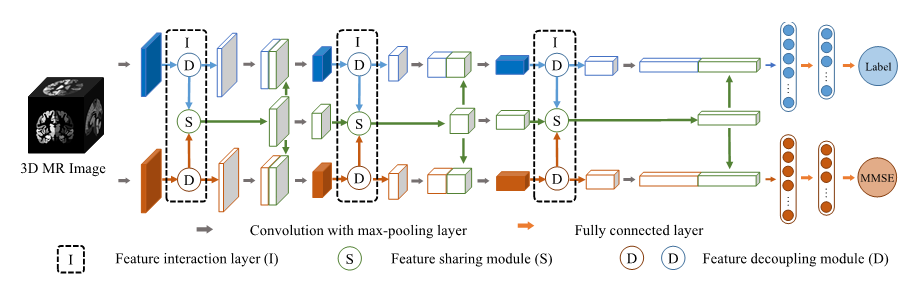

Copyright (C) 2022 Xu Tian (tianxu@csu.edu.cn), Jin Liu (liujin06@csu.edu.cn)

## Package Title: 
MRI-based Multi-task Decoupling Learning for Alzheimer's Disease Detection and MMSE Score Prediction: A Multi-site Validation

## Description:   
This package is designed to enable multi-task decoupled representation learning and automatic diagnosis and MMSE score prediction of AD patients from structural magnetic resonance imaging (sMRI) brain scans.

Fig. 1. Framework of our proposed method

As is shown in Fig.1. , we propose an MRI-based multi-task decoupled learning (MTDL) approach for AD detection and MMSE score prediction. First, we implement both tasks using the same backbone. We insert three multi-task interaction layers between these two backbones. Each multi-task interaction layer consists of two feature decoupling modules and one feature interaction module. It takes generalizable features for each task and interacts to obtain shared representations for both tasks. Second, in order to further improve the generalization of the features selected by the feature decoupling module, we design a feature consistency loss to further constrain the module. Finally, in order to exploit the special distribution information of MMSE scores in AD group and NC group, we design a distribution loss.

In this code, "config.json" places the model's hyperparameters and other information. "model.py" places the main CNN model. "model_wrapper.py" encapsulates the training, validation and testing process of the model. "model.py" encapsulates the main CNN model. "dataloader.py" encapsulates the data usage process required by the model. "loss.py" contains forward and backward computations for part of the model's loss.

## How to run this project:
This project must run in python>=2.7, The following steps should be taken to run this project:

1. Data preparation: Before the code can run, the data needs to be prepared. You need to put a file named "dataset.csv" in the "opencsv" folder. "dataset" is the name of the dataset in the configuration file. In this csv files, subjects' AD labels and MMSE scores should be placed in the second and third columns respectively.

To demonstrate this code, we provide data for 10 subjects from the ADNI1 dataset. These subjects were randomly selected from the test set of the experiments for the provided model files. These data are placed in the "data" folder and their label information is in the "opencsv" folder.

2. Environment building:  
    (1) Software: Information about the packages required by the code is at "requirements.txt".   
    (2) Hardware: This code has been tested with NVIDIA GTX2080.
   
3. Code running:    
    (1) Information about code running in "config.json" should be modified.   
    (2) You can use         
    
        python main.py   
      
   to complete the training and testing of the model, or use  

        python main.py train     
        python main.py test
      
   to complete them separately. 
   Also, we put our trained model file in this code, it can be directly used for AD detection and MMSE score prediction. If you want to use it, execute the following command

        python main.py valid
